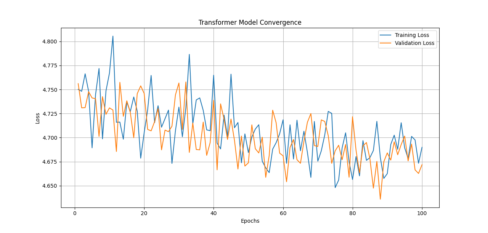

<h1>
Transformer Project
</h1>

1, Heat map of the Tranformer Model Output Weights --

2, Convergence Graph of the Tranformer Model Output Weights

 Reference - 1, https://www.datacamp.com/tutorial/building-a-transformer-with-py-torch

  2, Vaswani, Ashish, et al. “Attention Is All You Need.” ArXiv.org, 12 June 2017, arxiv.org/abs/1706.03762.

