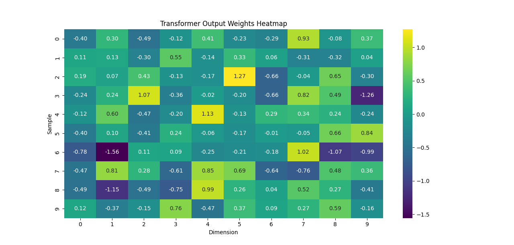

<h1>
Tranformer Project
</h1>

1, Heat map of the Tranformer Model Output Weights --

2, Convergence Graph of the Tranformer Model Output Weights

 Reference - https://www.datacamp.com/tutorial/building-a-transformer-with-py-torch

